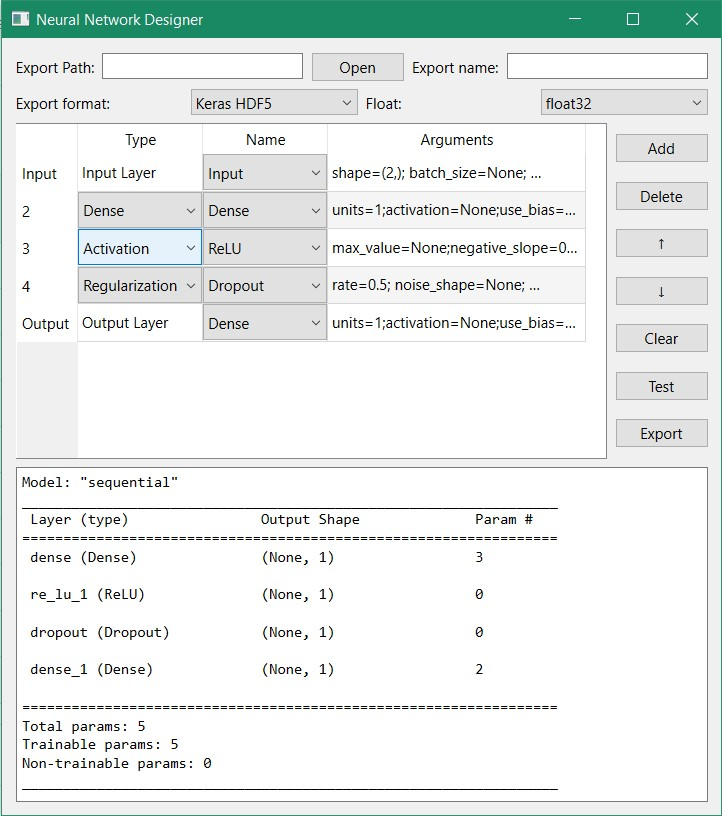

# Qt-NNDesigner

A Qt6 based GUI to create Keras Model and export.

## Installation

    poetry install

## Support Status

File Format: Keras HDF5, TensorFlow SavedModel, ONNX
Model structure: Sequential

## Images

